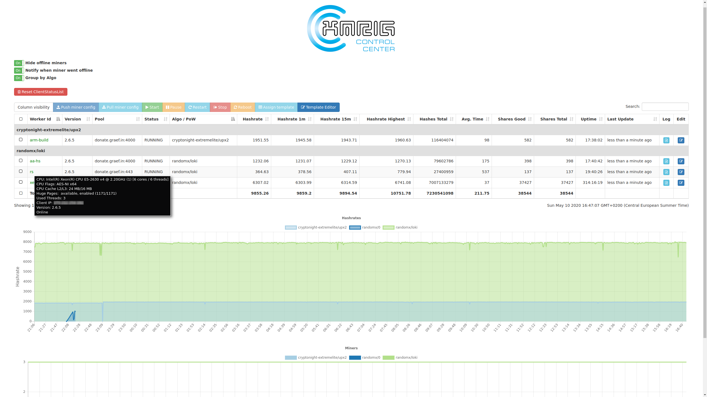

# XMRigCC 

XMRigCC is a high performance RandomX, CryptoNight and Argon2 CPU miner, with official support for Windows.

:bulb: **This is the CPU variant of XMRigCC, if you're looking for the AMD GPU (OpenCL) variant [click here](https://github.com/Bendr0id/xmrigCC-amd/).**

[](https://ci.appveyor.com/project/Bendr0id/xmrigcc)
[](https://hub.docker.com/r/bendr0id/xmrigcc/)
[](https://github.com/bendr0id/xmrigCC/releases)
[](https://github.com/bendr0id/xmrigCC/releases)
[](https://github.com/bendr0id/xmrigCC/releases)
[](https://github.com/bendr0id/xmrigCC/stargazers)


### About XMRigCC

XMRigCC is a [XMRig](https://github.com/xmrig/xmrig) fork which adds remote control and monitoring functions to XMRigCC miners. It lets you control your miners via a Dashboard or the REST api.
XMRigCC has a "Command and Control" (C&amp;C) server part, a daemon to keep the XMRigCC miner alive and modifications to send the current status to the C&amp;C Server.
The modified version can handle commands like "update config", "start/stop mining" or "restart/shutdown/reboot" which can be send from the C&amp;C-Server Dashboard. 
Assign config templates to multiple miners with a single click and let them switch configs without connecting to each of them.
Watch your miners logs with the simple remote Log viewer and monitor you miners. When the hashrate drops or one of your miners went offline you can get a notification via 
PushOver or Telegram automatically so that you dont need to watch your miners all day.

Full Windows/Linux compatible, and you can mix Linux and Windows miner on one XMRigCCServer.

## Additional features of XMRigCC (on top of XMRig)

* **Support of AstroBWT variant (algo: "astrobwt")**
* **Support of RandomKEVA variant (algo: "rx/keva")**
* **Support of CN-Talleo variant (algo: "cn-pico/tlo")**
* **Support of RandomSFX variant (algo: "rx/sfx")**
* **Support of RandomARQ variant (algo: "rx/arq")**
* **Support of UPX2 variant (algo: "cn-extremelite/upx2")**
* **Support of CN-Conceal variant (algo: "cn/conceal")**
* **Better performance for ARMv8 CPUs**
* Full SSL/TLS support
* NUMA support
* Command and control server
* CC Dashboard with:
    * statistics of all connected miners
    * remote control miners (start/stop/restart/shutdown) 
    * remote configuration changes of miners
    * simple config editor for miner / config templates 
    * monitoring / offline notification push notifications via Pushover and Telegram 
* Daemon to restart the miner


**XMRigCC Miner**


**XMRigCC Server**


**XMRigCC Dashboard**



#### Table of contents
* [Download](#download)
* [Usage](#usage)
* [Wiki/Building/Howto](https://github.com/Bendr0id/xmrigCC/wiki/)
* [Common Issues](#common-issues)
* [Donations](#donations)
* [Contacts](#contact)

## Download
* Binary releases: https://github.com/Bendr0id/xmrigCC/releases
* Git tree: https://github.com/Bendr0id/xmrigCC.git
  * Clone with `git clone https://github.com/Bendr0id/xmrigCC.git` :hammer: [Build instructions](https://github.com/xmrig/xmrig/wiki/Build.

## Usage
### Basic example XMRigCCServer
```
xmrigServer --port=3344 --user=admin --pass=pass --access-token=SECRET_TOKEN_TO_ACCESS_CC_SERVER
```

### Options XMRigCCServer
```
  -b, --bind arg                The CC Server bind ip (default: 0.0.0.0)
  -p, --port N                  The CC Server port
  -U, --user arg                The CC Server admin user
  -P, --pass arg                The CC Server admin pass
  -T, --token arg               The CC Server access token for the CC Client
  -t, --tls                     Enable SSL/TLS support
  -K, --key-file FILE           The private key file to use when TLS is ON
                                (default: server.key)
  -C, --cert-file FILE          The cert file to use when TLS is ON (default:
                                server.pem)
  -B, --background              Run the Server in the background
  -S, --syslog                  Log to the syslog
      --no-colors               Disable colored output
      --pushover-user-key arg   The user key for pushover notifications
      --pushover-api-token arg  The api token/keytoken of the application for
                                pushover notification
      --telegram-bot-token arg  The bot token for telegram notifications
      --telegram-chat-id arg    The chat-id for telegram notifications
      --push-miner-offline-info
                                Push notification for offline miners and
                                recovery (default: true)
      --push-miner-zero-hash-info
                                Push notification when miner reports 0
                                hashrate and recovers (default: true)
      --push-periodic-mining-status
                                Push every hour a status notification
                                (default: true)
      --custom-dashboard FILE   The custom dashboard to use (default:
                                index.html)
      --client-config-folder FOLDER
                                The CC Server access token for the CC Client
      --log-file FILE           The log file to write
      --client-log-lines-history N
                                Maximum lines of log history kept per miner
                                (default: 100)
  -c, --config FILE             The JSON-format configuration file to use
  -h, --help                    Print this help
```


### Basic example xmrigDaemon
```
xmrigDaemon -o pool.hashvault.pro:5555 -u YOUR_WALLET -p x -k --cc-url=IP_OF_CC_SERVER:PORT --cc-access-token=SECRET_TOKEN_TO_ACCESS_CC_SERVER --cc-worker-id=OPTIONAL_WORKER_NAME
```

### Options xmrigDaemon
```
Network:
  -o, --url=URL                 URL of mining server
  -a, --algo=ALGO               mining algorithm (https://github.com/Bendr0id/xmrigCC/blob/master/doc/ALGORITHMS.md)
      --coin=COIN               specify coin instead of algorithm
  -u, --user=USERNAME           username for mining server
  -p, --pass=PASSWORD           password for mining server
  -O, --userpass=U:P            username:password pair for mining server
  -x, --proxy=HOST:PORT         connect through a SOCKS5 proxy
  -k, --keepalive               send keepalived packet for prevent timeout (needs pool support)
      --nicehash                enable nicehash.com support
      --rig-id=ID               rig identifier for pool-side statistics (needs pool support)
      --tls                     enable SSL/TLS support (needs pool support)
      --tls-fingerprint=HEX     pool TLS certificate fingerprint for strict certificate pinning
      --daemon                  use daemon RPC instead of pool for solo mining
      --daemon-poll-interval=N  daemon poll interval in milliseconds (default: 1000)
      --self-select=URL         self-select block templates from URL
  -r, --retries=N               number of times to retry before switch to backup server (default: 5)
  -R, --retry-pause=N           time to pause between retries (default: 5)
      --user-agent              set custom user-agent string for pool
      --donate-level=N          donate level, default 5%% (5 minutes in 100 minutes)
      --donate-over-proxy=N     control donate over xmrig-proxy feature

CPU backend:
      --no-cpu                  disable CPU mining backend
  -t, --threads=N               number of CPU threads
  -v, --av=N                    algorithm variation, 0 auto select
      --cpu-affinity            set process affinity to CPU core(s), mask 0x3 for cores 0 and 1
      --cpu-priority            set process priority (0 idle, 2 normal to 5 highest)
      --cpu-max-threads-hint=N  maximum CPU threads count (in percentage) hint for autoconfig
      --cpu-memory-pool=N       number of 2 MB pages for persistent memory pool, -1 (auto), 0 (disable)
      --cpu-no-yield            prefer maximum hashrate rather than system response/stability
      --no-huge-pages           disable huge pages support
      --asm=ASM                 ASM optimizations, possible values: auto, none, intel, ryzen, bulldozer
      --randomx-init=N          threads count to initialize RandomX dataset
      --randomx-no-numa         disable NUMA support for RandomX
      --randomx-mode=MODE       RandomX mode: auto, fast, light
      --randomx-1gb-pages       use 1GB hugepages for dataset (Linux only)
      --randomx-wrmsr=N         write custom value (0-15) to Intel MSR register 0x1a4 or disable MSR mod (-1)
      --randomx-no-rdmsr        disable reverting initial MSR values on exit

API:
      --api-worker-id=ID        custom worker-id for API
      --api-id=ID               custom instance ID for API
      --http-host=HOST          bind host for HTTP API (default: 127.0.0.1)
      --http-port=N             bind port for HTTP API
      --http-access-token=T     access token for HTTP API
      --http-no-restricted      enable full remote access to HTTP API (only if access token set)

CC feature:
      --cc-disabled                 disable CC Client feature
      --cc-url=URL                  url of the CC Server
      --cc-access-token=T           access token for CC Server
      --cc-worker-id=ID             custom worker-id for CC Server
      --cc-update-interval-s=N      status update interval in seconds (default: 10 min: 1)
      --cc-use-tls                  enable tls encryption for CC communication
      --cc-use-remote-logging       enable remote logging on CC Server
      --cc-upload-config-on-start   upload current miner config to CC Server on startup
      --cc-reboot-cmd=CMD           command/bat to execute to Reboot miner machine

Logging:
  -S, --syslog                  use system log for output messages
  -l, --log-file=FILE           log all output to a file
      --print-time=N            print hashrate report every N seconds
      --no-color                disable colored output
      --verbose                 verbose output

Misc:
  -c, --config=FILE             load a JSON-format configuration file
  -B, --background              run the miner in the background
  -V, --version                 output version information and exit
  -h, --help                    display this help and exit
      --dry-run                 test configuration and exit
      --export-topology         export hwloc topology to a XML file and exit
```


## Common Issues
### XMRigMiner
* XMRigMiner is just the worker, it is not designed to work standalone. Please start **XMRigDaemon** instead.

### Windows only: DLL error on starting
* Make sure that you installed latest Visual C++ Redistributable for Visual Studio 2015. Can be downloaded here: [microsoft.com](https://www.microsoft.com/de-de/download/details.aspx?id=48145)

### Linux only: Background mode
* The `--background` option will only work properly for the XMRigServer. But there is a simple workaround for the XMRigDaemon process. Just append an `&` to the command and it will run smoothly in the background.

    `./xmrigDaemon --config=my_config_cc.json &` or you just use `screen`


### HUGE PAGES unavailable (Windows)
* Run XMRigDaemon as Administrator.
* On Windows it automatically enables SeLockMemoryPrivilege for current user, but reboot or sign out still required. [Manual instruction](https://msdn.microsoft.com/en-gb/library/ms190730.aspx).

### HUGE PAGES unavailable (Linux)
* Before starting XMRigDaemon set huge pages

    `sudo sysctl -w vm.nr_hugepages=128`

 
## Donations
* Default donation 5% (5 minutes in 100 minutes) can be reduced to 1% via command line option `--donate-level`. 

##### BenDroid (XMRigCC):
XMR:  `4BEn3sSa2SsHBcwa9dNdKnGvvbyHPABr2JzoY7omn7DA2hPv84pVFvwDrcwMCWgz3dQVcrkw3gE9aTC9Mi5HxzkfF9ev1eH`

AEON: `Wmtm4S2cQ8uEBBAVjvbiaVAPv2d6gA1mAUmBmjna4VF7VixLxLRUYag5cvsym3WnuzdJ9zvhQ3Xwa8gWxPDPRfcQ3AUkYra3W`

BTC:  `3Gwq9tveCZtLAiXX7mxhjbrh38GPx1iXdB`

##### xmrig:
XMR:  `48edfHu7V9Z84YzzMa6fUueoELZ9ZRXq9VetWzYGzKt52XU5xvqgzYnDK9URnRoJMk1j8nLwEVsaSWJ4fhdUyZijBGUicoD`

BTC:  `1P7ujsXeX7GxQwHNnJsRMgAdNkFZmNVqJT`

## Contact
* ben [at] graef.in
* [telegram](https://telegram.me/bendr0id)
* [discord](https://discord.gg/r3rCKTB)
* [reddit](https://www.reddit.com/user/BenDr0id/)
